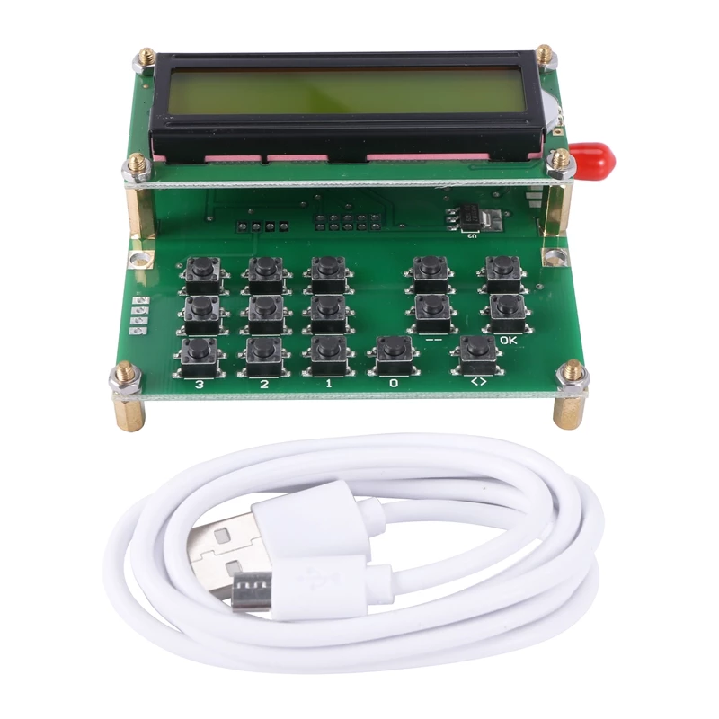

# adf4351_atmega8
Documentation and schematics for ADF4351 RF  generator with atmega8 MCU control, 16 x 2 character LCD and 15 buttons manufactured in China.

Looks like Pavel, OK1DX / KF9VM already documented this 6 months before me.

http://ok1dx.cz/constructions/4g_gen/4g_gen.html
